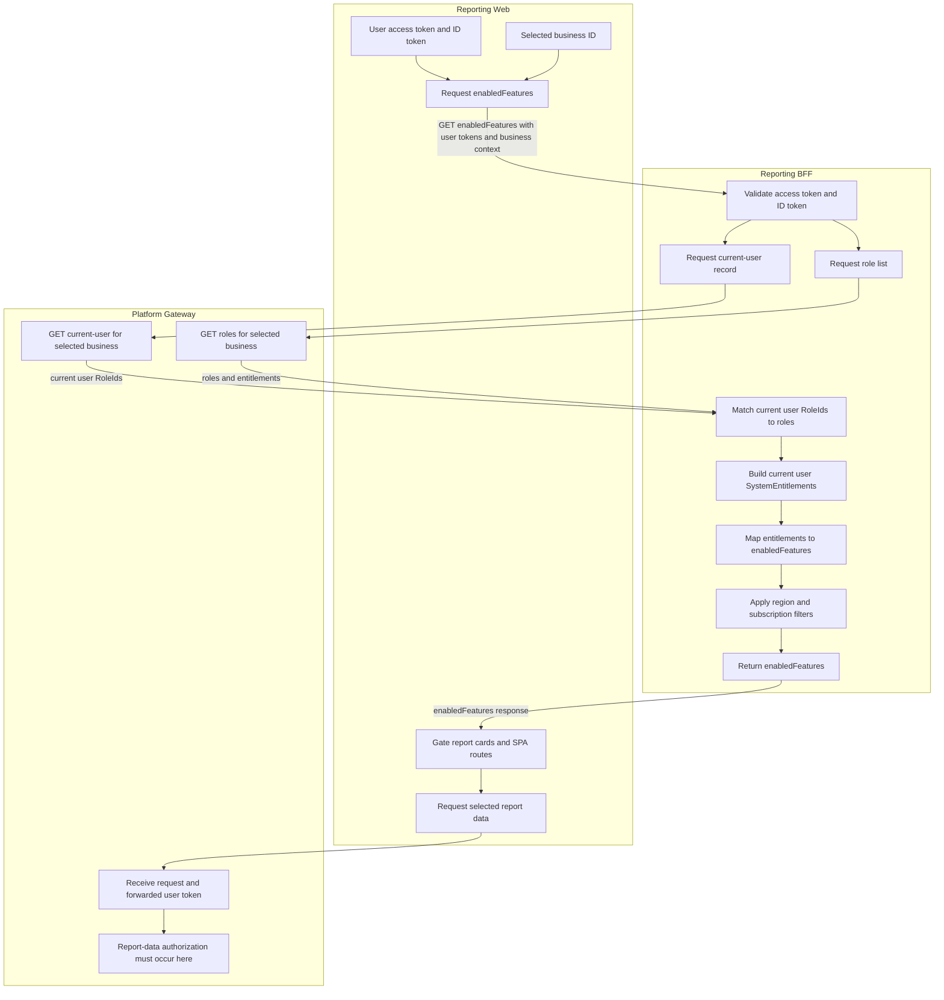

# How roles control report access

## Executive summary

For a selected business, the Reporting BFF converts the user's roles into entitlements and then into enabled features, subject to region and subscription rules. Reporting Web uses those features for report visibility and SPA route gating.

Reporting Web sends the user's access token and ID token as credentials, together
with the selected business context. It does not send roles or entitlements. The
BFF uses that context to obtain the business's `current-user` record and role
list through the platform gateway, derives the user's entitlement list, then
returns the resulting `enabledFeatures` list to Reporting Web.

## Payroll reports

`ReportsPayroll` enables these Australian report features in the BFF and Reporting Web:

| Report | User-facing name | Required feature |
| --- | --- | --- |
| EntitlementsBalanceSummary | Leave balance | `reportsLeaveBalance` |
| EntitlementsBalanceDetail | Leave balance (detail) | `reportsLeaveBalanceDetail` |
| PayrollVerification | Payroll verification | `reportsPayrollVerification` |
| PayrollActivity | Payroll activity | `reportsPayrollActivity` |

## Security boundary

Client-side hiding and `PermissionDeniedView` are not authorization. Each report-data service must authorize the caller for both the requested report and business on every request; the BFF identity-token check alone does not establish a report entitlement.

## Expected outcome after the authorization patch

The BFF already evaluates widget and report availability server-side from the
user's business-scoped roles, entitlements, region, and subscription. The
report-data patch should enforce the same effective feature for the requested
report, after validating the caller's token and access to the selected business.

With that alignment, normal authorized users should see no functional change:
their available report widgets and report-data requests continue to match.
Users without the required entitlement are already hidden from the relevant
widgets; after the patch, direct report-data requests are denied as well.

## Evidence

- Role-to-feature calculation: `reporting-backends/bff/src/business/transformers/buildUserEntitlements.js`, `enabledFeatures/transformers/buildEntitlementFeatures.js`, `buildEntitlementFeatureMap.js`, and `enabledFeaturesTransformer.js`.
- Web feature and route gates: `reporting-web/src/integration/sagas/enabledFeaturesIntegration.js`, `components/Reports/reportDetailsEnums.js`, and `Switch.js`.
- Payroll BFF paths and downstream routes: the four payroll routers/services under `reporting-backends/bff/src/{leaveBalanceSummary,leaveBalanceDetail,payrollVerification,payrollActivity}`.
- P&L BFF path and management-reporting target: `reporting-backends/bff/src/profitLoss/profitLossRouter.js` and `profitLossService.js`.
- Identity-token verification and token forwarding: `reporting-backends/bff/src/middleware/authorizationMiddleware.js` and `reporting-backends/shared/src/util/common/axios-util.js`.

## Security Notes

The documented boundary separates role-derived UI gating from request authorization and identifies the report, business, and caller checks required downstream. Final downstream authorization, token-validation policy, access logging, and any rate limits must be verified and configured in the owning report-data service.
