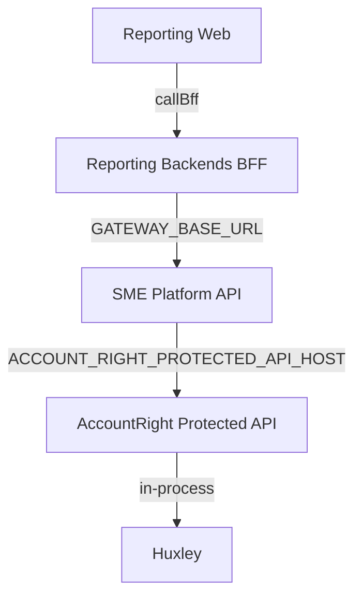
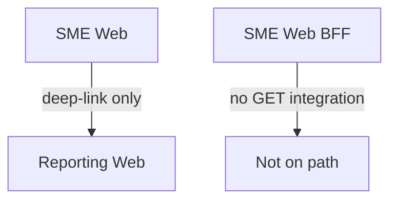
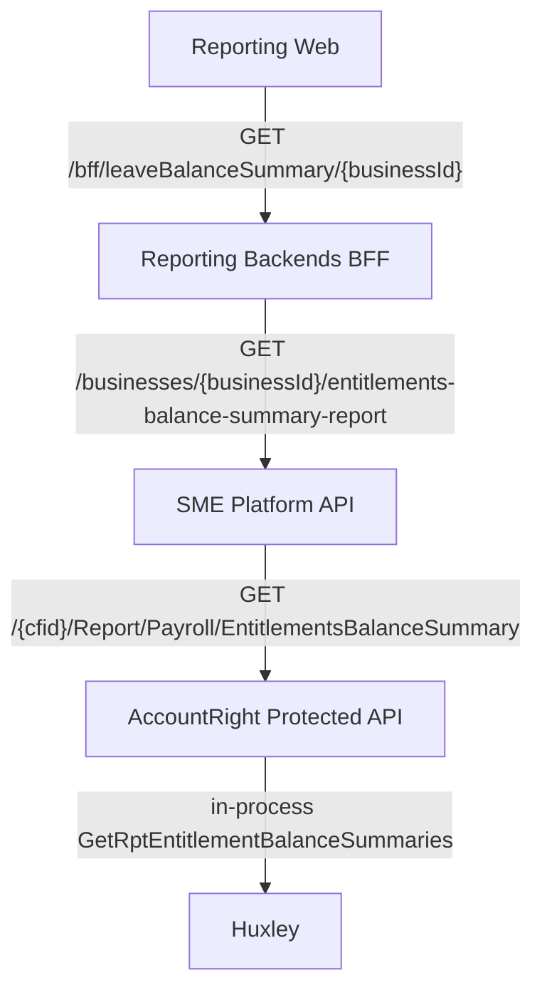
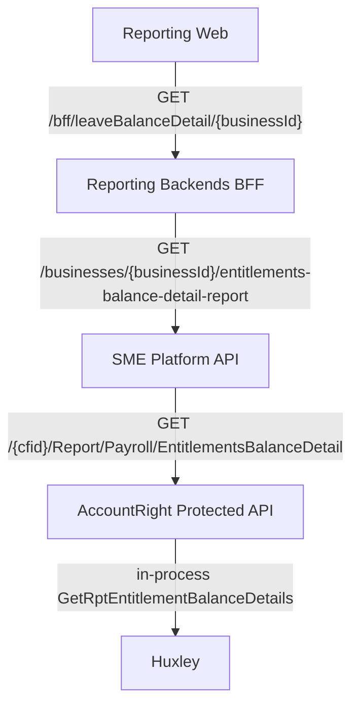
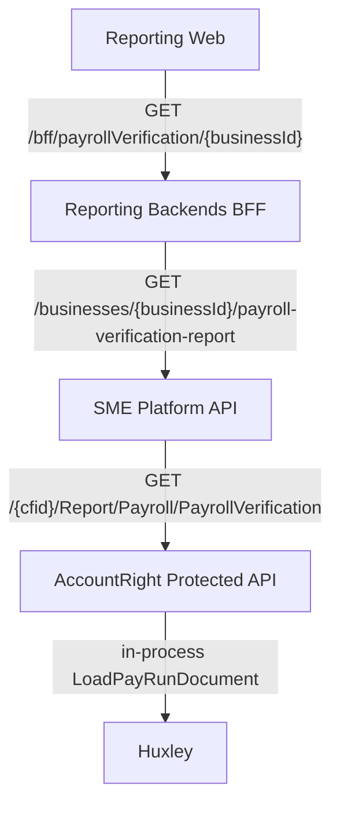
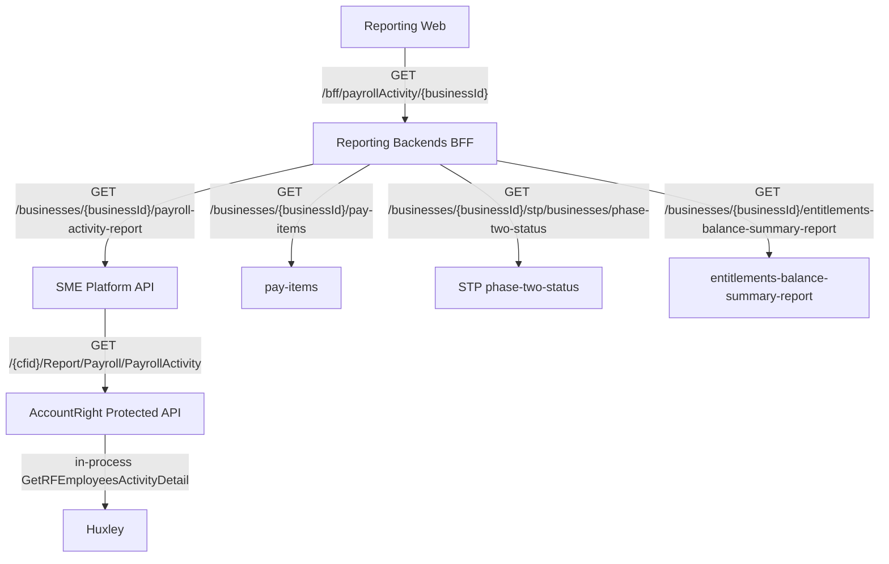
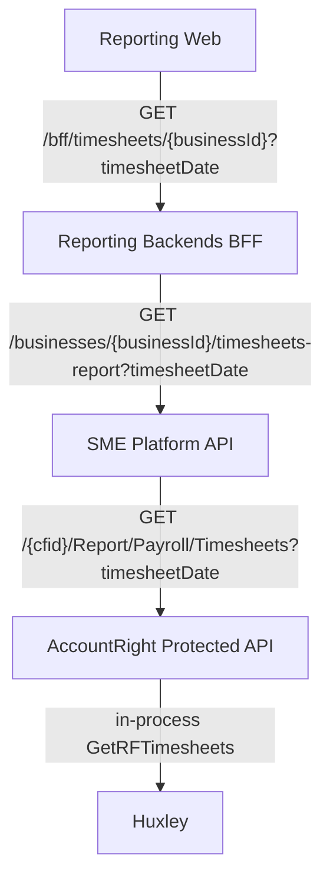

# Payroll report invocation chains

These diagrams map the five AccountRight Protected API GET reports already traced. Each hop is the inbound route or the immediate downstream client in that repository. Internal business-method chains are collapsed.

## Naming

The requested path used `{company_cfid}`. Implemented routing uses:

- Reporting Web / Reporting BFF path param: `{businessId}`
- SME Platform API path param: `{business-id}` (nginx capture group)
- AccountRight Protected API path param: `{cfid}`

Date filters are `fromDate` / `toDate` in Reporting Web and `dateFrom` / `dateTo` from the BFF onward.

## SME Platform adapter feature comparison

The expected empty feature values are not present. All five `adapter-config.lua`
files define a non-empty `feature()` value; Timesheets is only unique in using
the value `timesheets-report`.

| Protected API endpoint | Adapter config | `feature()` value |
|---|---|---|
| `EntitlementsBalanceSummary` | `entitlements-balance-summary/adapter-config.lua` | `entitlements-balance-summary-report` |
| `EntitlementsBalanceDetail` | `entitlements-balance-detail/adapter-config.lua` | `entitlements-balance-detail-report` |
| `PayrollVerification` | `payroll-verification/adapter-config.lua` | `payroll-verification-report` |
| `PayrollActivity` | `payroll-activity/adapter-config.lua` | `payroll-activity-report` |
| `Timesheets` | `timesheets/adapter-config.lua` | `timesheets-report` |

## Shared HTTP shape

All five GET reports follow the same HTTP chain. Huxley is an in-process terminal, not another HTTP hop.

SME Web is not on this HTTP path. Dashboard favourites deep-link into Reporting Web. SME Web BFF has no GET handler for these four reports.

## EntitlementsBalanceSummary

Product name: Leave Balance Summary.

Query: `fromDate` / `toDate` / `displayByEmployeesOrLeave` in the UI; BFF remaps dates to `dateFrom` / `dateTo`.

Terminal: `IPresentationPayrollService.GetRptEntitlementBalanceSummaries`.

## EntitlementsBalanceDetail

Product name: Leave Balance Detail.

Query: `fromDate` / `toDate` / `displayByEmployeesOrLeave` in the UI; BFF remaps to `dateFrom` / `dateTo` / `sortBy`.

Terminal: `IPresentationPayrollService.GetRptEntitlementBalanceDetails`.

## PayrollVerification

Product name: Payroll Verification.

No date query parameters.

Terminal: `IPayRunContainerService.LoadPayRunDocument` (also uses `IPresentationLookupService`).

The NZ pay-run file download `GET /{businessId}/nz-payroll/payRun/payrollVerificationReport/{draftPayRunId}` and the SME Web BFF pay-run preview `POST /businesses/{businessId}/payroll-verification-report/export` are separate from this GET report.

## PayrollActivity

Product name: Payroll Activity.

Query: `fromDate` / `toDate` in the UI; BFF remaps to `dateFrom` / `dateTo`.

Terminal: `IPresentationPayrollService.GetRFEmployeesActivityDetail`.

The BFF fans out to four gateway GETs. Only `payroll-activity-report` maps to Protected API `PayrollActivity`. The leave-balance call reuses EntitlementsBalanceSummary.

## Timesheets

Product name: Timesheets.

Query: `timesheetDate` is sourced from the Reporting Web `toDate` filter. The
name passes unchanged through Reporting Backends and SME Platform API; ASP.NET
binds it case-insensitively to `TimesheetDate`.

Terminal: `IPresentationPayrollService.GetRFTimesheets`.

`timesheets/adapter-config.lua` is the only adapter in this comparison whose
feature is `timesheets-report`; it is not the only adapter with a feature value.
SME Web and SME Web BFF have no invocation of this timesheets report path.

## Source map

| Protected API | Reporting Web saga | Reporting BFF | Platform Lua route | Protected controller |
|---|---|---|---|---|
| `GET /{cfid}/Report/Payroll/EntitlementsBalanceSummary` | `leaveBalanceSummaryIntegration.js` | `leaveBalanceSummaryRouter.js` | `entitlements-balance-summary/route.lua` | `EntitlementBalanceSummaryController.Get` |
| `GET /{cfid}/Report/Payroll/EntitlementsBalanceDetail` | `leaveBalanceDetailIntegration.js` | `leaveBalanceDetailRouter.js` | `entitlements-balance-detail/route.lua` | `EntitlementBalanceDetailController.Get` |
| `GET /{cfid}/Report/Payroll/PayrollVerification` | `payrollVerificationIntegration.js` | `payrollVerificationRouter.js` | `payroll-verification/route.lua` | `PayrollVerificationController.Get` |
| `GET /{cfid}/Report/Payroll/PayrollActivity` | `payrollActivityIntegration.js` | `payrollActivityRouter.js` / `payrollActivityService.js` | `payroll-activity/route.lua` | `PayrollActivityController.Get` |
| `GET /{cfid}/Report/Payroll/Timesheets` | `timesheetsIntegration.js` | `timesheetsRouter.js` / `timesheetsService.js` | `timesheets/route.lua` | `TimesheetsController.Get` |
